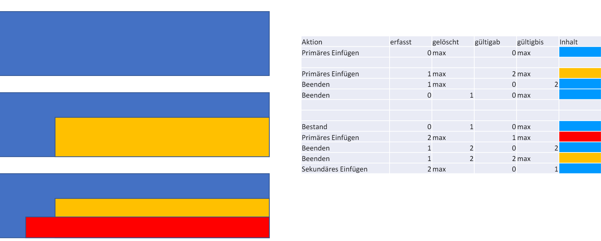

# bitemporal
# A pilot project for a poor man's bitemporal data management using a simple application level transaction and workflow logic

The project is based on this framework:
https://github.com/digitallyinduced/ihp

## Bitemporal data model
### The spatial analogy

A bitemporal model allows for modelling change in two dimensions of time:
* referenced time like e.g. in contracts that are agreed to be valid for a certain time, and secondly
* transaction time, like e.g. the time, when a contract 
or a change of contract is agreed upon

For instance, we agreed
* on Monday to paint the house blue next year,
* on Tuesday to paint it yellow two years later, and
* on Wednesday to paint it red already one year later
* and leave it at that.

The first idea of this approach is spatial representation of the two temporal dimensions.
The above course of agreements
would be described by sets of adjacent rectangles, reference time running horizontally, 
transaction time vertically.

Colloquially phrased, such a model provides answers to questions like 

"What did we think at *transaction time* what we agreed upon as of *referenced time*"

Reference time and transaction time can be seen as
constituting a point which is contained in a 
of a set of rectangles of validity and thus identifies a version.

### Composite bitemporal objects

The second idea is based on the fact that object attributes maybe independendent from one another, for instance we 
repaint the house more often, than we change the janitor.

In the example above each (re-)paint of the house, produces a new version, the color of which differs from its predecessor, while the name of the janitor does not.
If we differentiate house attributes into house-color and house-janitor, we can have three versions of house-color and just one of house-janitor, provided, that 
these attribute groups reference not only the version for which a given value became valid, but also the version for which it became invalid, if any.
So we transform the house table 

| version | color | janitor |
|--------:|:------|:--------|
|1        | blue  | Müller  |
|2        | yellow | Müller  |
|3        | red | Müller  |

into two tables: house-color and house-janitor

| fromversion | thruversion | color  | |  fromversion | thruversion | janitor |
|------------:|------------:|:-------|-|:-------------|------------:|:--------|
|1            | 2           | blue   | |1             |             | Müller  |
|2            | 3           | yellow |
|3            |             | red    | 

The state of attributes relevant to a version v is determined by this condition
* the version that created a detail is older or equal to v
and
* the version by which the detail was changed or deleted is younger than v.
 
Combining both ideas, we evaluate the states of attributes of an object with respect to a point of validity *pv* made of transaction and referenced time, as follows:
* we identify the version *v* of the object pertaining to that point of validity by finding the area of validity *rv* that contains *pv* and take 
  its creating version as *v* 
* Attribute states relevant to this *pv* can be identified by *v* between the state's creating and invalidating version, which is the reason why version IDs must be monotonely ascending with time.

### Bitemporal Consistency: 
The areas describing the validity of the versions of an object 
* must not overlap, and
* must be contiguous

in order to guarantee, that a given transaction and reference time identify at least and at most one version.

Application domain specific consistency requires that, only versions of an attribute state, that has no successor (terminal state), can be updated. Update here means, that a succeeding version is created. Consistency of the attribute states can only be accomplished by the domain specific functions that transform the current state plus user input into the resulting state. Validation of an attribute state cannot be had apart from its construction. So updating a state that has successors invalidates those, as we *cannot in general* determine, what aspects of the successor state are independent of the change in the predecessor and how the dependent aspaects should change accordingly.

### Class Diagram: 

#### history
Histories consist of
- an UUID, which denotes the identy of an aggregate object over time.
A history changes when one of its components changes: this is modelled by its versions.

#### version
Version data consist of 
- an id, from an ordered class, assigned monotonely ascending at creation,
- a reference to
- their history instance
and attributes 
- validfrom
- created at a
- status a domain of { *committed*,*workinprogress*}

#### component
Components are an abstract class, that denotes identities of parts. Change of a component is denoted by its attribute state and its versions. Components are a recursive structure, the root of wich denotes the entire aggregate. Child components denote entities which are regarded as having no existence independent from the root component. 

Components have 
- an id
and reference
- a history

#### state
Attribute states are an abstract class that denotes the state of attributes of components and their change.
States have 
- an id
refererence
- the version for which the state was created, *refvalidfrom*, and
- and, possibly, to that which invalidated, *refvalidthru*, it.

## *the current implementation has only root components and identifies them with the history.*

##### contract, partner, tariff
These are examples of realizations of root components. 

##### contractState, partnerState, tariffState
These are examples of realizations of root component states. 

##### contractPartner, productItem
These are examples of child components, which have no existence independent of their parent components. 
E.g. a non existing partner cannot have a contract (which, of course, does not mean that person must be alive). 

#### workflow (not shown)_
Workflow data refer to 
- a user and 
- a version
and attributes for
- state of work
- persistence log

### Bitemporal CRUD

Bitemporal CRUD differs from vanilla (common) CRUD in - aside from manipulating attribute state - that
* transaction and or reference time maybe required as parameters, and
* additional bookkeeping of Histories, Versions and ValidityRectangles is necessary.

#### Transactions

##### Concurrency

As objects may only be created or updated by creating a new version from the terminal version, the existence of a new version, that is one with status = *workinprogress*,  functions as a lock on the object. Such objects may only be manipulated by the owner of the version as indicated by the workflow. The owner can access attribute states by the new version. 

Other users may access attribute state only by *committed* versions. 

Validity Rectangles are created and updated when a version is committed. They are not needed by the owner of the *workinprogress*-version, and they must only make *committed* versions visible

#### CREATE

##### create first attribute state, history and *workinprogress* version
* Parameters: reference time date, state attributes
* creates a history instance
* creates a version instance which refers to the history instance with validfrom as from the parameter and status=*workinprogress*
* creates an attribute state which refers to the history and to the version as validfromversion.
* sets the history id and the version id as current history and version ids

##### create following attribute state (for the same history) of a *workinprogress* version
* precondition: user must match owner of versions workflow
* Parameters: current version id, state attributes
*  creates an attribute state which refers to the history and to the version as validfromversion.

#### READ

##### read by point of validity
* Parameters: history id, reference time, transaction time
* reads attribute states for *committed* versions

##### read by *committed* version
* Parameters: history id, reference time, transaction time
* reads attribute states for *committed* version

##### read by *workinprogress* version
* precondition: user must match owner of versions workflow
* Parameters: history id, reference time, transaction time
* reads attribute states for *workinprogress* versions

#### UPDATE
##### first update 
* precondition: no *workinprogress* version exists for history
* Parameters: history id,  reference time
* reads attribute state by transaction time = current time and reference time = the parameter 
* creates a version instance which refers to the history instance with validfrom as from the parameter  and status=*workinprogress*
* creates a copy of the attribute state and sets its validfromversion to the new version.
* sets the history id and the version id as current history and version ids

##### following updates of the same object 
* precondition: user must match owner of versions workflow
* Parameters: version id
* update attribute state

 
Mutation of payload data *p1* at transaction time *txn* and per reference time *ref*
* inserts new a version v1 with status= *workinprogress* and a rectangle *r1* referring to *v1* with values *validfrom*= *ref* , *validthru*=NULL, *created*=*txn* and *invalidate*=NULL,
* Sets *p1.ref_creator*=v1 and *p1.ref_invalidator*=NULL
* Updates the previous payload *p0* as *p0.ref_invalidator*=v1
* for all rectangles *r* of a committed version of the current entity where the intervals [*validfrom*,*validthru*[ and [*created*,*invalidated*[ overlap with *r1*:
    - *r.invalidated* is updated to *txn*
    - if *r.validfrom* is before *r1.validfrom*, a copy of r, *r0*, is created with: *r0.created*=*txn*, *r0.nvalidated*=NULL, *r0.validthru*=*v1.validfrom*
* *v1.status* is set to *committed*
### Rollback

Rollback is provided by deletion of the current version *v1* and propagated by cascade and setnull actions of the foreign key constraints involved
 ... provided that IHP gets BigSerial PrimaryKeys: Now there are only UUIDS which are not monotonously ascending, so that comparing version keys could not determine, which one is newer. But that again is crucial to finding payload states, wehere ref_creator must be smaller than ref_invalidator.

### Transaction isolation

Transaction isolation is provided by marking versions as committed or in progress respectively. 
* Read access may only access data state via committed versions.
* Write access must create a new version in progress. There may only be one such version at a given time.
see Bitemporale Historisierung.ppt

## *Long transactions* and workflow

As with application level transactions we can have persistent non committed state that can be exchanged between processes may they be dialogical or atutomated asynchronic, i.e. batch parocessing. This means that workflow is supported immedatiately.